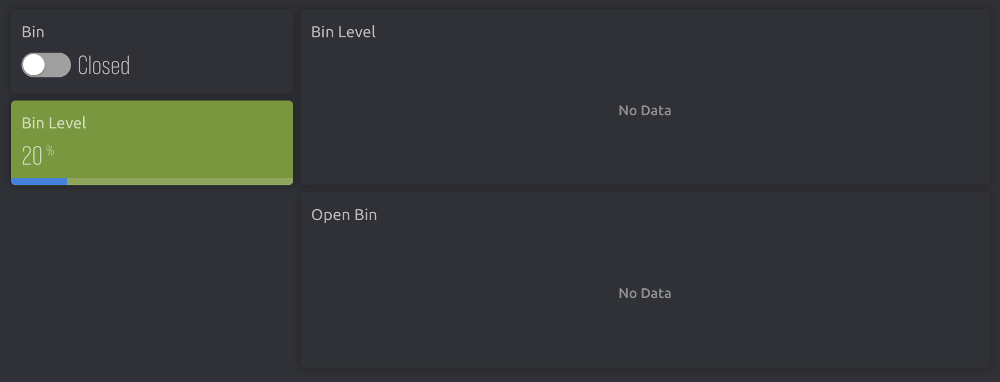
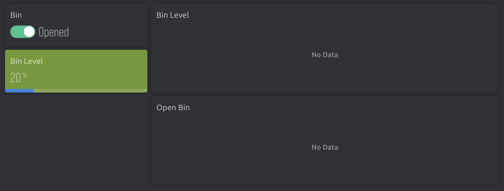

<h1 align="center">SWM</h1>

<h2>📰About</h2>

<b>neshto</b>

<h2 align = "left">🧒Our team</h2>
<ul>
<li><a href = "https://github.com/ATApostolov21"> Atanas Apostolov </a> [Front-end developer]
</li>
<li><a href = "https://github.com/IDDochev21"> Ivan Dochev </a> [Back-end developer]</li>
</ul>

<h2>📷Screenshots</h2>

<h2>📥Installation</h2>

1.Open a terminal on you local machine and clone the repository by the link bellow.

<pre>https://github.com/ATApostolov21/SWM.git</pre>

2.Open <a href = "https://blynk.io/" > blynk.io </a> and select <b>TRASHKO</b> as your project.
 

3.Make sure you have connected both Trashko and your PC/laptop to a <b>2.4 GHz</b> Wi-Fi network.

4.Power up the <b>Smart Waste Management</b> device.

5.Wait a <b>few seconds</b> and you are ready to go!

<h2>📃Documents</h2>
<h3>Documentation</h3>
<ul>
<li><a href="Documents/SWM_JhonAtanasov.docx" download>Documentation</a></li>
</ul>
<h3>Presentation</h3>
<ul>
<li><a href="../SWM/Documents/SWM_JhonAtanasov.pptx" download>Presentation</a></li>
</ul>

<h2>🖥️Technologies</h2>
<h3> Code editors and collaborative services used:</h3>

    
    
    
    

<h3>Programming languages and third party libraries:</h3>

    
    

<h3>Sofware used for remote interaction:</h3>

    

<h3>Used programs for creating documentation and presentation:</h3>

  
   

<h3 align = "center">Thank you for checking out our repo! If you had a good time you can leave us a ⭐!</h3>
